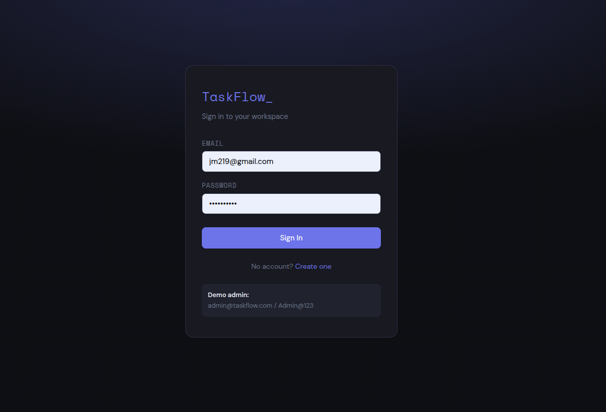
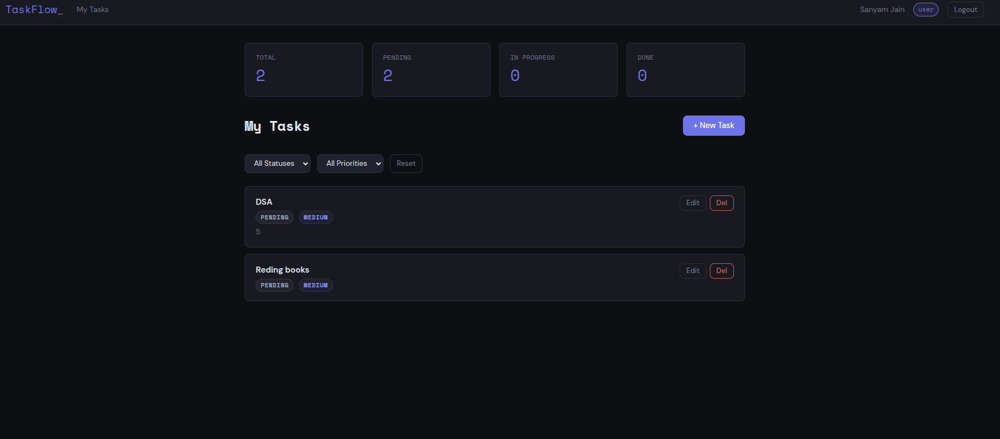
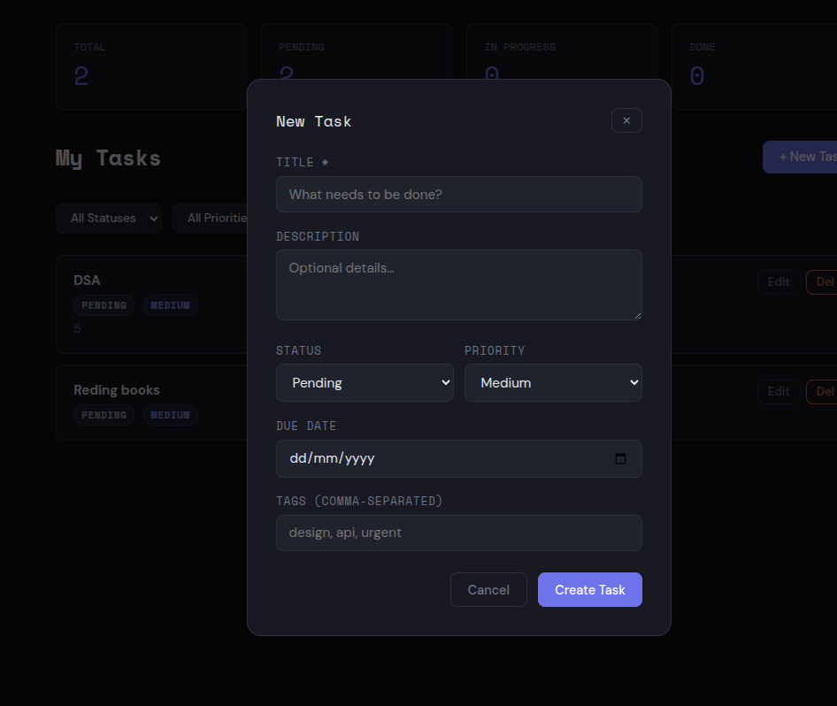

# 🚀 TaskFlow - Full Stack Task Management System

A full-stack task management application built with **Node.js, Express, MongoDB, React, and Redis caching**.
It supports authentication, role-based access, and CRUD operations for tasks.

---

## 📌 Features

* 🔐 JWT Authentication (Access + Refresh Token)
* 👤 Role-Based Access (User / Admin)
* ✅ Create, Read, Update, Delete Tasks
* ⚡ Axios Interceptors (Auto token refresh)
* 📊 Dashboard with filters & pagination
* 🚀 Redis Caching (optional)
* 🎯 Clean UI with React

---

## 🛠️ Tech Stack

### Backend

* Node.js
* Express.js
* MongoDB (Mongoose)
* JWT Authentication
* Redis (ioredis)

### Frontend

* React.js
* Axios
* React Router

---

## 📂 Project Structure

```
/backend
  /controllers
  /models
  /routes
  /middlewares
  server.js

/frontend
  /components
  /pages
  /context
  /services
```

---

## ⚙️ Setup Instructions

### 1️⃣ Clone Repository

```
git clone https://github.com/Sanyam302/Backend_assesment.git
cd taskflow
```

---

## 🔧 Backend Setup

```
cd backend
npm install
```

### Create `.env` file

```
PORT=5000
MONGO_URI=your_mongodb_uri
ACCESS_TOKEN_SECRET=your_secret
REFRESH_TOKEN_SECRET=your_secret
NODE_ENV=development
```

### Run Backend

```
npm run dev
```

---

## 💻 Frontend Setup

```
cd frontend
npm install
npm run dev
```

---

## 🌐 API Endpoints

### Auth

* POST `/api/auth/login`
* POST `/api/auth/register`
* POST `/api/auth/refresh-token`
* POST `/api/auth/logout`

### Tasks

* GET `/api/tasks/get`
* POST `/api/tasks/create`
* PUT `/api/tasks/update/:id`
* DELETE `/api/tasks/delete/:id`

---

## 🔄 Authentication Flow

1. User logs in → gets access + refresh token
2. Access token used for API calls
3. If expired → interceptor calls refresh API
4. New access token issued automatically

---

## 🧪 Testing

You can test APIs using:

* Postman
* Thunder Client

---


---

## 📸 Screenshots




---

## 🤝 Contribution

Feel free to fork this repo and improve it.

---

## 📧 Contact

Sanyam Jain
📩 jsanyam219@gmail.com

---

## ⭐ If you like this project

Give it a star ⭐ on GitHub!
